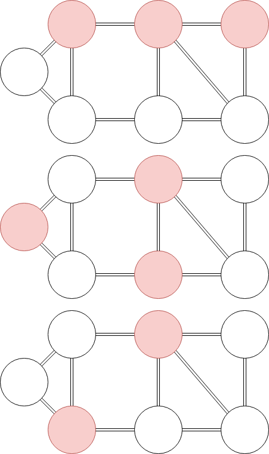
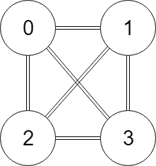

A dominating set of vertices is a set of vertices in a graph where every vertex not in the dominating set is adjacent to a vertex that is in the dominating set. Below is an example of three different dominating sets for one graph.

This program finds the smallest possible minimum dominating set, i.e. the dominating set with the fewest vertices required to dominate the graph. This algorithm is based on pseudocode provided by Dr. Wendy Myrvold and can be found here: http://webhome.cs.uvic.ca/~wendym/courses/422/17/notes/422_03_dom_alg.pdf

These graphs are passed in to this program through txt files formatted in the following manner:
4    3 1 2 3    3 0 2 3     3 0 1 3     3 0 1 2 

The first value is the number of vertices in the graph. The second value is the number of vertices that the first vertex is adjacent to, followed by the values representing them. In this example, there are 4 vertices, and the first vertex (vertex 0) is adjacent to 3 verticies: 1, 2, and 3. Vertex 1 has 3 vertices adjacent to it, which are vertices 0, 2, and 3, and so on. The graph given in this example looks like the following:

The amount of whitespace separating each integer is arbitrary.
